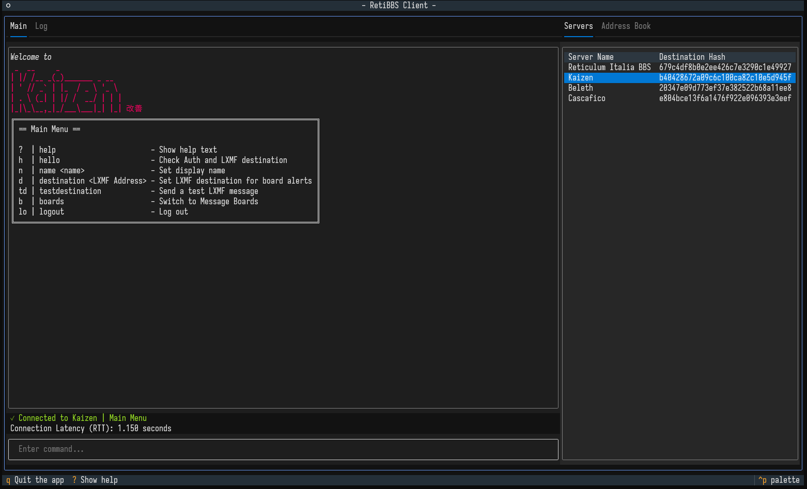
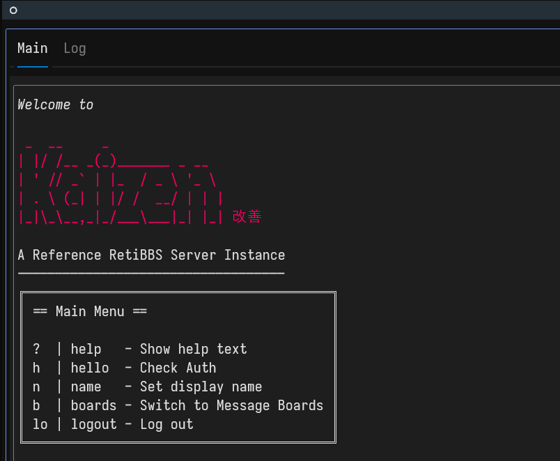

# RetiBBS



An ALPHA bulletin board system (BBS) implementation for Reticulum networks.

RetiBBS allows users to communicate through message boards in a secure manner.

## Features

- User authentication and authorization with Reticulum
- Multiple message boards support
- User display names
- Admin privileges for board management
- Simple text-based command interface

## Reference Implementation

A reference RetiBBS server implementation is hosted by me, at Kaizen.

Its identity hash is: `b40428672a09c6c100ca82c10e5d945f` or you can wait for the server to announce itself. The server is connected to the Beleth RNS Hub, which in turn is connected to the Reticulum Testnet.

I will try to keep this reference implementation up to date, usually within a couple hours of any PR merges. This means that the reference server _may_ be unavailable for a short time while the updates are applied.

# Installation

It is strongly suggested to use this alpha software in its own Python virtual environment.
```sh
python -m venv .venv
source .venv/bin/activate
```

1. Install Textual and the Reticulum Network Stack:
```sh
pip install rns textual
```

2. Clone this repository:
```sh
git clone https://github.com/kc1awv/RetiBBS.git
cd RetiBBS
```

## Usage

### Running the Server
```sh
cd server
python retibbs_server.py [OPTIONS]
```

#### Server options:
- `--reticulum-config`: Path to alternative Reticulum config directory (optional)
- `--identity-file`: Path to store/load server identity (default: server_identity.pem)
- `--config-file`: Path to server config file (default: server_config.json)

### Running the Client
```sh
cd client
python retibbs_textual.py [OPTIONS]
```

#### Client options
- `--reticulum-config`: Path to alternative Reticulum config directory (optional)
- `--identity-file`: Path to store/load client identity (optional, default: {RNS.Reticulum.storagepath}/retibbs_client_identity)
- `--server`: Hexadecimal hash of the RetiBBS server to connect to (optional)

## Basic Commands

### Once connected:
```
Main Menu:

  ?  | help               - Show help text and available commands
  h  | hello              - Check authorization status
  n  | name <name>        - Set your display name
  b  | boards             - Switch to message boards area
  lo | logout             - Log out from the system

### Admin Commands
  lu | listusers          - List users in DB
  a  | admin <user_hash>  - Grant admin rights to a user
```

Each area has its own set of commands. Use `?` or `help` to get a list of commands for the area you are in.

## Configuration

### Server Configuration (server_config.json)
```json
{
    "server_name": "changeme",
    "announce_interval": 300,
    "theme": "default"
}
```

### Server Themes
Included with the base code is a default theme in `server/themes/default` that can be copied to a new folder in order to create a new 'theme' for the BBS. Simply:
```bash
cd server/themes
cp -r default/ new_theme/
cd new_theme
```
And edit the text files within. Make sure to update the `server_config.json` file to point towards the new theme directory.

[Rich Text](https://github.com/Textualize/rich) support for colors and other styles is available from commit [26bc656](https://github.com/kc1awv/RetiBBS/commit/26bc6564170c486aa21d1e8e2edc7b60b95b6dc4) in the client.

Using [Rich Text Markup](https://rich.readthedocs.io/en/latest/markup.html) in the theme files is probably the easiest way to utilize colors. For example:

```
[bold italic]Welcome to[/]
[bold red]
 _  __     _
| |/ /__ _(_)_______ _ __
| ' // _` | |_  / _ \ '_ \
| . \ (_| | |/ /  __/ | | |
|_|\_\__,_|_/___\___|_| |_| 改善
[/]
A Reference RetiBBS Server Instance
-----------------------------------
```
will produce this on the client:



Clients not up to date with at least commit `26bc656` will show the markup. If you see the markup code where colors are expected, please pull the latest commit.

### Client Address Book (address_book.json)
Saved servers are stored in JSON format with server names and hashes.

Example:
```json
{
    "019e6ad5a0e47048413c9f7578e83393": {
        "display_name": "Beleth Test",
        "hash": "019e6ad5a0e47048413c9f7578e83393",
        "timestamp": "2025-01-01 13:31:08"
    }
}
```

## Development
The codebase is organized into these main components:

- Server (server): Handles client connections, message boards, and user management
- Client (client): Provides the user interface and server connection handling

## Security

RetiBBS utilizes Reticulum's built-in encryption and authentication mechanisms to ensure secure communication between clients and servers.

## Requirements

- Python 3.x
- [Reticulum Network Stack](https://reticulum.network/)
- [Textual](https://textual.textualize.io/)
