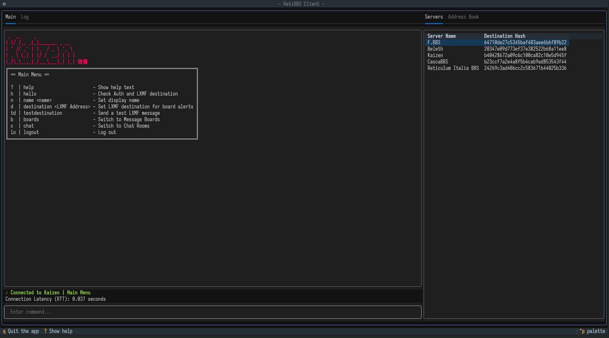

# RetiBBS



An ALPHA bulletin board system (BBS) implementation for Reticulum networks.

RetiBBS allows users to communicate through message boards in a secure manner.

## Features

- User authentication and authorization with Reticulum
- Multiple message boards support
- User display names
- Admin privileges for board management
- Simple text-based command interface

# Installation

It is strongly suggested to use this alpha software in its own Python virtual environment.
```sh
python -m venv .venv
source .venv/bin/activate
```

1. Install Textual and the Reticulum Network Stack:
```sh
pip install rns textual
```

2. Clone this repository:
```sh
git clone https://github.com/kc1awv/RetiBBS.git
cd RetiBBS
```

## Usage

### Running the Server
```sh
cd server
python retibbs_server.py [OPTIONS]
```

#### Server options:
- `--reticulum-config`: Path to alternative Reticulum config directory (optional)
- `--identity-file`: Path to store/load server identity (default: server_identity.pem)
- `--auth-file`: Path to store/load authorized users (default: authorized.json)
- `--config-file`: Path to server config file (default: server_config.json)

### Running the Client
```sh
cd client
python retibbs_textual.py [OPTIONS]
```

#### Client options
- `--reticulum-config`: Path to alternative Reticulum config directory (optional)
- `--identity-file`: Path to store/load client identity (default: {RNS.Reticulum.storagepath}/retibbs_client_identity)
- `--server`: Hexadecimal hash of the RetiBBS server to connect to (optional)

## Basic Commands

### Once connected:
```
  ?  | help               - Show help text and available commands
  h  | hello              - Check authorization status
  n  | name <name>        - Set your display name
  lb | listboards         - List all available boards
  b  | board <boardname>  - Switch to a specific board
  p  | post <text>        - Post a message to current board
  l  | list [boardname]   - List messages in a board
  lo | logout             - Log out from the system

### Admin Commands
  cb | createboard <name>       - Create a new board
  db | deleteboard <boardname>  - Delete an existing board
  a  | admin <user_hash>        - Grant admin rights to a user
```

## Configuration

### Server Configuration (server_config.json)
```json
{
    "server_name": "My RetiBBS Server",
    "announce_interval": 300
}
```

### Client Address Book (address_book.json)
Saved servers are stored in JSON format with server names and hashes.

Example:
```json
{
    "019e6ad5a0e47048413c9f7578e83393": {
        "display_name": "Beleth Test",
        "hash": "019e6ad5a0e47048413c9f7578e83393",
        "timestamp": "2025-01-01 13:31:08"
    }
}
```

## Development
The codebase is organized into these main components:

- Server (server): Handles client connections, message boards, and user management
- Client (client): Provides the user interface and server connection handling

## Security

RetiBBS utilizes Reticulum's built-in encryption and authentication mechanisms to ensure secure communication between clients and servers.

## Requirements

- Python 3.x
- [Reticulum Network Stack](https://reticulum.network/)
- [Textual](https://textual.textualize.io/)
